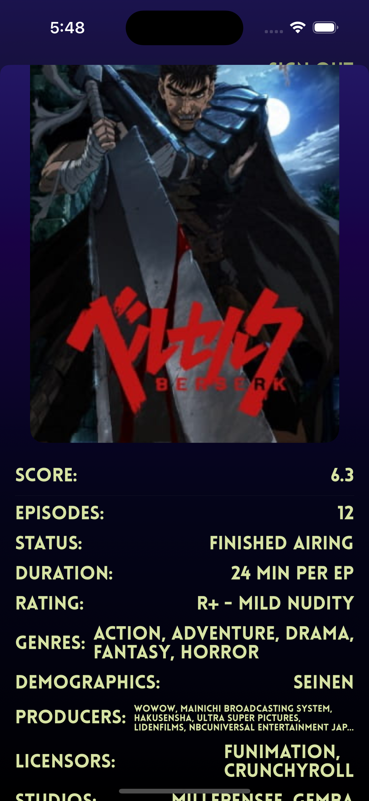

# AMS-SwiftUI

AMS-SwiftUI is a comprehensive iOS application designed for tracking anime and manga, showcasing advanced iOS development skills using SwiftUI and Firebase. This project demonstrates key software development principles, including MVVM architecture, real-time data synchronization, and secure user authentication.
## Features

- **User Authentication**: Secure login and user management using Firebase.
- **Data Storage**: Real-time database integration with Firebase Firestore.
- **MVVM Architecture**: Efficient state management using the Model-View-ViewModel pattern.
- **Interactive UI**: Responsive and user-friendly interfaces built with SwiftUI.
- **API Integration**: Fetching and displaying data from external APIs.

## Video Demo


## Screenshots

<p float="left">
  
  
  
  
   
</p>

## Getting Started

### Prerequisites
- GoogleService-Info.plist file
- Firebase account

### Installation

1. Clone the repository:
   ```bash
   git clone https://github.com/sramim/AMS-SwiftUI.git
2. Open the project in Xcode:
   ```bash
   cd AMS-SwiftUI
    open AnimeMangaStack.xcodeproj
3. Running the App:
   Configure Firebase and add your `GoogleService-Info.plist`
